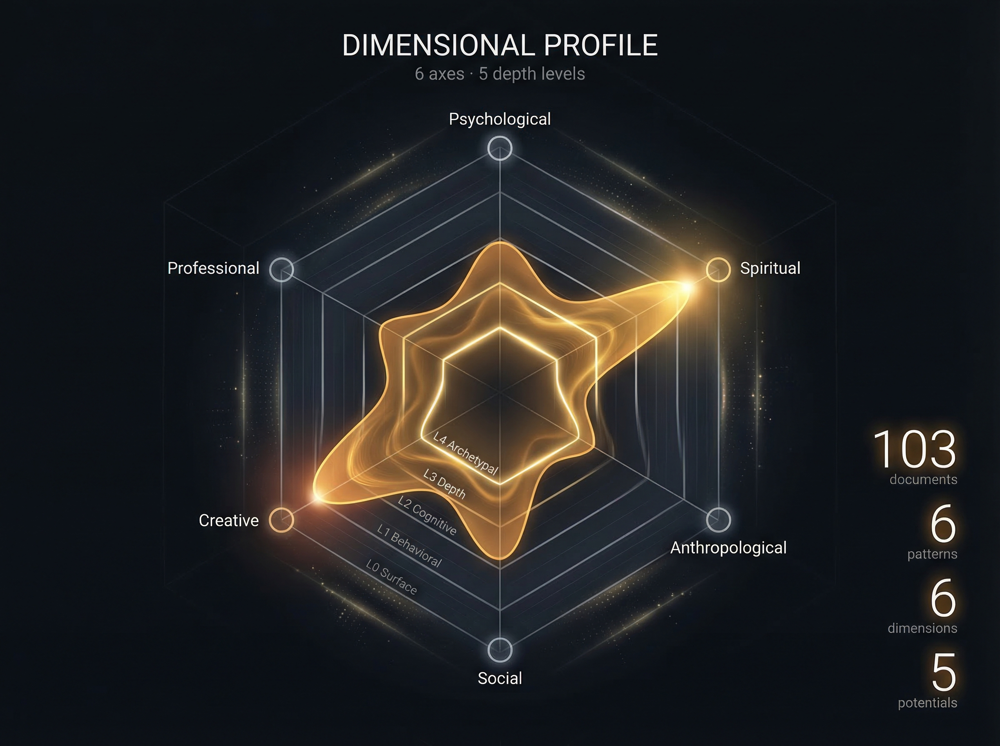

<p align="center">
  
</p>

# PSYCHE/OS

<p align="center">
  <strong>Digital Psyche Operating System</strong><br />
  A local-first pipeline that turns your digital traces into a navigable psychological map.
</p>

<p align="center">
  Experimental, typographic, privacy-aware, and evolving in public.
</p>

<p align="center">
  <a href="https://github.com/michelericco/psyche-os/actions/workflows/ci.yml"></a>
  <a href="./LICENSE"></a>
  
  
</p>

---

## What It Does

<p align="center">
  
</p>

PSYCHE/OS reads the data you already produce — chat sessions, bookmarks, code history, browsing traces, notes — and extracts structure from it. Not generic self-help. Not personality quizzes. Computed structure, cross-validated across sources, with evidence you can inspect.

The core idea is simple:

- use data that already describes your behavior
- inspect it locally instead of handing it to opaque systems
- compute structure, not summaries
- move toward a directional vector, not a pile of advice

> It does not diagnose. It maps.

---

## How It Works

<p align="center">
  
</p>

PSYCHE/OS follows a strict principle: **keep only what survives cross-source validation.** A pattern that shows up in your Claude sessions, your X bookmarks, *and* your YouTube history is a real signal. One that appears in a single source is noise.

<p align="center">
  
</p>

```
Sources (exported data)
    ↓  source-specific adapters
Extraction (structured signals per source)
    ↓  cross-source synthesis
Patterns (only what survives comparison)
    ↓  dimensional analysis
Map (navigable psychological structure)
    ↓
Outputs (cognitive genome, narrative arc, directional vector)
```

### What the pipeline produces

- **Patterns** — recurring behaviors cross-validated across sources
- **Cognitive primitives** — fundamental operations of your thinking
- **Archetypes** — latent roles and identities across contexts
- **Dimensional scores** — psychological, cognitive, social, creative, professional, spiritual axes
- **Narrative arc** — chapters, tensions, current direction
- **Directional vector** — where your life pattern seems to want to go
- **Semantic map** — entities, themes, and relationships

The intended end state is not a recommendation engine. It is a directional reading: a vector that summarizes where the strongest signals point when compared side by side.

---

## Plug and Play: Feed Your AI Agents

<p align="center">
  
</p>

PSYCHE/OS is not just an analysis tool. It generates ready-to-use outputs that plug directly into your AI workflow.

The **Integration** view in the dashboard produces five export formats, each designed for a different integration surface:

| Export | What it does | Target |
|--------|-------------|--------|
| **System Prompt Generator** | Full cognitive profile as a system prompt — patterns, archetypes, dimensions, genome, narrative arc. Copy and paste into any AI chat. | Claude.ai, ChatGPT, Gemini, any LLM |
| **MCP Server Configuration** | JSON config that exposes PSYCHE/OS as callable tools (`get_patterns`, `get_archetypes`, `get_dimensions`, `get_potentials`, `get_genome`, `search_analysis`). | Claude Code, MCP-compatible agents |
| **Memory Plugin Format** | Compact CLAUDE.md block with top patterns, archetypes, genome, and narrative. Drop it into your project config. | Claude Code persistent memory |
| **Structured Data Export** | Full analysis as a single downloadable JSON object. | Data pipelines, custom agents, LangChain, CrewAI |
| **API Endpoint Schema** | OpenAPI 3.0 spec for serving PSYCHE/OS data via HTTP. | Custom integrations, hosted APIs |

In practice: run the pipeline once, open the Integration tab, copy the output you need, and your AI agent has full cognitive context.

The **Onboarding** view guides you through connecting each data source with copy-pasteable commands for Claude Code, Codex CLI, X/Twitter (via Siftly), YouTube (via Google Takeout), and cloud AI conversations (Claude.ai, ChatGPT, Gemini).

---

### Example Output: Cognitive Genome

From 103 documents across 6 sources, the pipeline extracted 8 cognitive primitives from synthetic demo data:

| Primitive | Confidence | Evidence |
|-----------|-----------|----------|
| Failure-Driven Learning | 0.92 | Error logs treated as foundational reference |
| Systematic Abstraction Descent | 0.90 | Progressive simplification across frameworks |
| Fractal Pattern Transfer | 0.88 | Same structure applied across different substrates |
| Infrastructure-First Construction | 0.88 | Scaffolding as a mode of thinking |
| Empirical-Mystical Oscillation | 0.88 | Alternating contemplative and technical modes |
| Cost-Conscious Optimization | 0.88 | Efficiency as aesthetic principle |
| Naming-as-Cognition | 0.82 | Naming as a tool for conceptual transformation |
| Burst-Process-Burst Rhythm | 0.82 | Productive silence between output phases |

---

## What It Maps

<p>
  
  
</p>
<p>
  
  
</p>

The pipeline produces navigable structure across multiple layers:

- **Dimensions** — six-axis profile (psychological, spiritual, anthropological, social, creative, professional) with five depth levels from surface behavior to archetypal core
- **Semantic map** — entities, themes, and relationships as a knowledge graph
- **Archetypes** — dominant, secondary, emergent, and golden shadow figures in tension
- **Narrative arc** — life chapters, current tension point, possible resolutions
- **Patterns and potentials** — cross-validated behavioral signals with confidence scores
- **Neurodivergence screening** — evidence-based, explicitly not diagnosis

---

## Supported Sources

<p align="center">
  
</p>

Each source has a dedicated `SourceAdapter`:

- **Claude Code** — JSONL session histories with conversation extraction and session metadata
- **Codex CLI** — JSONL session histories with message parsing and CLI version tracking
- **X/Twitter bookmarks** — Markdown exports (via Siftly) with topic classification and bookmark counts
- **YouTube** — Markdown playlists and watch history from Google Takeout
- **OpenClaw** — Local domain knowledge (openclaw-local) and hierarchical memory vault (openclaw-m1)

Additional sources supported through manual prompt handoff:

- Long-form conversations with Claude.ai, ChatGPT, and Gemini
- Adjacent CLI and agent-session workflows that can be normalized into the extraction format

If a source can be exported, it can probably become an adapter. If any of these sound familiar, this repo is probably meant for you:

- a deep archive of Claude or ChatGPT conversations you suspect says more about you than you remember
- Claude Code or Codex sessions that capture how you think while building, debugging, and deciding
- hundreds of X bookmarks that felt important enough to save, but not important enough to ever open again
- a YouTube `Watch Later` queue that quietly became an accidental map of interests, aspirations, and unfinished lines of inquiry

---

## Quick Start

Requirements: Node.js 20+, npm, Python 3.10+ (for vector search helpers)

```bash
git clone https://github.com/michelericco/psyche-os.git
cd psyche-os
npm install
npm --prefix web install
```

Run the interface:

```bash
npm --prefix web run dev
```

Open `http://localhost:5173`.

### Running The Pipeline

Full local flow:

```bash
bash scripts/run-full-pipeline.sh
```

Or run the stages individually:

These script names are the same commands shown in the web onboarding Setup view.

```bash
bash scripts/extract-claude-sessions.sh
bash scripts/extract-codex-sessions.sh
bash scripts/extract-social-traces.sh
bash scripts/synthesize.sh
bash scripts/neurodivergence.sh
```

Optional semantic search:

```bash
pip install chromadb sentence-transformers
python3 scripts/create-embeddings.py
python3 scripts/search-embeddings.py "shadow integration" --top 5
```

Validation:

```bash
npm run validate
```

Guardrails check:

```bash
npm run guardrails:check
```

Optional local pre-commit hook (not enforced for the team):

```bash
npm run hooks:install
```

Hook management:

```bash
npm run hooks:status
npm run hooks:uninstall
```

Temporary bypass for one commit:

```bash
SKIP_GUARDRAILS=1 git commit -m "..."
```

Safe auto-push (explicit opt-in, protected branch blocked by default):

```bash
AUTO_PUSH_ENABLED=1 AUTO_PUSH_BRANCH=feature/my-branch bash auto-push.sh
```

To allow auto-push on `main`/`master`, explicitly set:

```bash
AUTO_PUSH_ALLOW_PROTECTED=1
```

---

## Repository Structure

- `web/`: React dashboard
- `scripts/`: extraction, synthesis, and embedding helpers
- `src/`: TypeScript core pipeline
  - `src/pipeline/adapters/`: source-aware adapters (Claude Code, Codex, Twitter, YouTube, OpenClaw)
- `tests/`: unit, integration, and E2E tests with fixtures
- `docs/`: methodology, foundations, and deployment notes
- `output/`: generated analysis artifacts, gitignored except for `.gitkeep`

## Method And Direction

The methodology is intentionally becoming stricter:

- extraction should maximize signal without inflating interpretation
- synthesis should keep only what survives cross-source comparison
- outputs should remain inspectable and evidence-linked
- the final reading should move toward a coherent directional vector

Project docs: [Pipeline methodology](docs/pipeline-methodology.md) · [Analytic foundations](docs/analytic-foundations.md) · [Prompt evaluation rubric](docs/evaluation-rubric.md)

## Design Principles

- **Local-first** — No cloud, no sync. Your data stays on your machine.
- **Evidence-linked** — Every insight cites its source. Interpretations are hypotheses, not identity statements.
- **Ontology-first** — Schema before data. Structure emerges, not imposed.
- **Privacy by architecture** — Access control is structural, not policy-based.

## Privacy And Safety

This project can touch intensely personal material. Please treat it with care.

- Never commit `sources/`, `output/`, extraction dumps, chat logs, or generated profiles.
- Never attach real personal datasets to GitHub issues or pull requests.
- Use sanitized fixtures and synthetic screenshots in public discussion.
- Do not treat outputs as diagnosis, therapy, or clinical assessment.
- Treat interpretations as hypotheses that need scrutiny, not identity statements.

The default `.gitignore` already protects the most sensitive paths.

## Contributing

Contributions are welcome, especially in:

- source adapters and importers
- prompt design and extraction normalization
- synthesis logic and evidence calibration
- evaluation, regression fixtures, and quality gates
- scientific grounding across psychology, sociology, anthropology, philosophy, and cognition
- accessibility, performance, and UI refinement

Start with [CONTRIBUTING.md](CONTRIBUTING.md). Security: [SECURITY.md](SECURITY.md). Community: [CODE_OF_CONDUCT.md](CODE_OF_CONDUCT.md).

## Project Status

**Solid:** interface and visual language, local-first baseline, extraction and synthesis surfaces, demo data and documentation hygiene.

**Evolving:** adapter breadth, synthesis depth, evaluation rigor, directional-vector quality, broader data compatibility.

The project is open now because it already has a clear direction, and it will improve through careful use, critique, and contribution.
