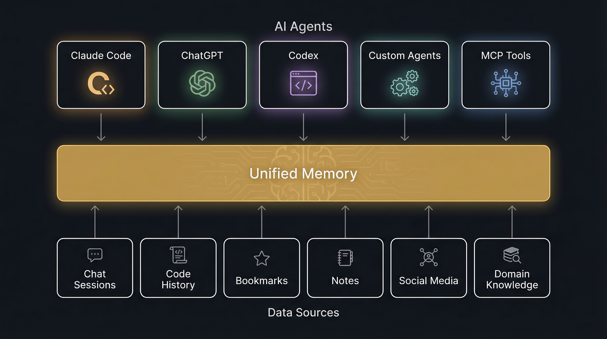
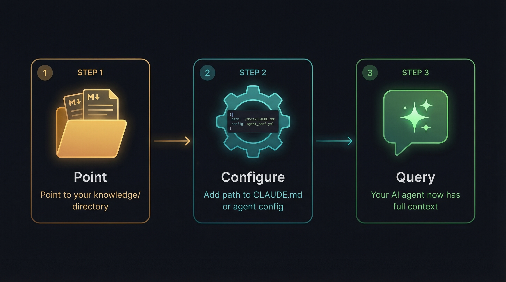

<p align="center">
  
</p>

# PSYCHE/OS

<p align="center">
  <strong>Digital Psyche Operating System</strong><br />
  Plug-and-play memory for AI agents — and a pipeline that turns your digital traces into a navigable psychological map.
</p>

<p align="center">
  <a href="https://github.com/michelericco/psyche-os/actions/workflows/ci.yml"></a>
  <a href="./LICENSE"></a>
  
  
  
</p>

---

## Two Layers, One System

<p align="center">
  
</p>

PSYCHE/OS operates on two levels that feed each other:

**Layer 1 — Unified Memory** (practical, immediate)
A `knowledge/` directory of structured Markdown files. Point any AI agent at it and it instantly knows who you are, what you're building, how you work, and what mistakes to avoid. No API, no database — just plain text any LLM can read.

**Layer 2 — Psyche Pipeline** (deep, analytical)
A TypeScript pipeline that reads your digital traces — chat sessions, bookmarks, code history, notes — and extracts patterns, cognitive primitives, archetypes, narrative arcs, and directional potentials. Only what survives cross-source comparison makes it to the map.

> The first layer tells your agent *what you know*. The second reveals *how you think*.
> The deep layer feeds back into the practical one: the pipeline generates a `cognitive-genome.md` that agents can read.

---

## Agent Memory: Plug and Play

<p align="center">
  
</p>

The `knowledge/` directory works as plug-and-play persistent context for any AI tool:

<p align="center">
  
</p>

### Connect to your agent

**Claude Code** — add to `CLAUDE.md`:
```markdown
@path/to/knowledge/identity.md
@path/to/knowledge/projects.md
@path/to/knowledge/preferences.md
@path/to/knowledge/cognitive-genome.md
```

**ChatGPT / Custom GPTs** — paste into system prompt or memory:
```
Read the following knowledge files for persistent context:
[paste contents of knowledge/*.md]
```

**OpenAI Codex / agents** — reference in agent config:
```yaml
context_files:
  - path/to/knowledge/
```

**Any LLM with file access** (MCP, LangChain, CrewAI, AutoGen):
```bash
knowledge_path: "./knowledge/"
```

### Knowledge Files

Each file is a self-contained context module:

| File | What it gives your agent |
|------|--------------------------|
| `identity.md` | Who you are — name, languages, interests, psych profile |
| `career.md` | Professional context — role, tools, approach |
| `projects.md` | What you're building — stacks, status, goals |
| `preferences.md` | How you work — communication, code style, tool preferences |
| `corrections.md` | Mistakes AI keeps making with you |
| `infrastructure.md` | Your setup — hardware, servers, services |
| `domain-*.md` | Domain expertise (e.g. railway, logistics) |
| `cognitive-genome.md` | How you think — primitives, blind spots, rhythm |

Pick what you need. Use all files for full context, or select specific ones for focused agents.

---

## The Psyche Pipeline: Deep Analysis

> *It does not diagnose. It maps.*


PSYCHE/OS reads the data you already produce and computes structure from it. The core principle: **keep only what survives cross-source validation.** A pattern that shows up in your Claude sessions, your X bookmarks, *and* your YouTube history is a real signal. One that appears in a single source is noise.

```
Sources (raw data)
    ↓  source-specific adapters
Extraction (structured signals per source)
    ↓  cross-source synthesis
Patterns (only what survives comparison)
    ↓  dimensional analysis
Map (navigable psychological structure)
    ↓
Cognitive Genome → feeds back into knowledge/
```

### What the pipeline produces

- **Patterns** — recurring behaviors cross-validated across sources
- **Cognitive primitives** — fundamental operations of your thinking
- **Archetypes** — latent roles and identities across contexts
- **Dimensional scores** — psychological, cognitive, social, creative, professional, spiritual axes
- **Narrative arc** — chapters, tensions, current direction
- **Directional vector** — where your life pattern seems to want to go
- **Semantic map** — entities, themes, and relationships

The intended end state is not a recommendation engine. It is a directional reading: a vector that summarizes where the strongest signals point when compared side by side.

### Example: Cognitive Genome

From 103 documents across 6 sources, the pipeline extracted 8 cognitive primitives:

| Primitive | Confidence | Evidence |
|-----------|-----------|----------|
| Failure-Driven Learning | 0.92 | regressions.md as constitutional law |
| Systematic Abstraction Descent | 0.90 | React→vanilla→Apps Script |
| Fractal Pattern Transfer | 0.88 | MCP→EUFMCP, same structure different substrate |
| Infrastructure-First Construction | 0.88 | Scaffolding IS thinking |
| Empirical-Mystical Oscillation | 0.88 | 7am contemplation, 9am TDD |
| Cost-Conscious Optimization | 0.88 | Efficiency as aesthetic |
| Naming-as-Cognition | 0.82 | Names create cognitive handles |
| Burst-Process-Burst Rhythm | 0.82 | Silence between notes matters |

This becomes `knowledge/cognitive-genome.md` — which agents read for deeper understanding of *how* you think, not just *what* you know.

---

## Current Interface

<p>
  
  
</p>
<p>
  
  
</p>

All README screenshots are generated from synthetic demo data, not from personal source material.

The dashboard includes:

- setup and pipeline orchestration
- overview, dimensions, patterns, archetypes, and potentials
- narrative arc and tension reading
- neurodivergence screening with explicit caveats
- semantic map plus local vector search
- prompt export and integration surfaces

---

## Supported Sources

Each source has a dedicated `SourceAdapter`:

- **Claude Code** — JSONL session histories with conversation extraction and session metadata
- **Codex CLI** — JSONL session histories with message parsing and CLI version tracking
- **X/Twitter bookmarks** — Markdown exports (via Siftly) with topic classification and bookmark counts
- **YouTube** — Markdown playlists and watch history from Google Takeout
- **OpenClaw** — Local domain knowledge (openclaw-local) and hierarchical memory vault (openclaw-m1)

Additional sources supported through manual prompt handoff:

- Long-form conversations with Claude.ai, ChatGPT, and Gemini
- Adjacent CLI and agent-session workflows that can be normalized into the extraction format

If a source can be exported, it can probably become an adapter. If any of these sound familiar, this repo is probably meant for you:

- a deep archive of Claude or ChatGPT conversations you suspect says more about you than you remember
- Claude Code or Codex sessions that capture how you think while building, debugging, and deciding
- hundreds of X bookmarks that felt important enough to save, but not important enough to ever open again
- a YouTube `Watch Later` queue that quietly became an accidental map of interests, aspirations, and unfinished lines of inquiry

---

## Quick Start

Requirements: Node.js 20+, npm, Python 3.10+ (for vector search helpers)

```bash
git clone https://github.com/michelericco/psyche-os.git
cd psyche-os
npm install
npm --prefix web install
```

Run the interface:

```bash
npm --prefix web run dev
```

Open `http://localhost:5173`.

### Running The Pipeline

Full local flow:

```bash
bash scripts/run-full-pipeline.sh
```

Or run the stages individually:

```bash
bash scripts/extract-claude-sessions.sh
bash scripts/extract-codex-sessions.sh
bash scripts/extract-social-traces.sh
bash scripts/synthesize.sh
bash scripts/neurodivergence.sh
```

Optional semantic search:

```bash
pip install chromadb sentence-transformers
python3 scripts/create-embeddings.py
python3 scripts/search-embeddings.py "shadow integration" --top 5
```

Validation:

```bash
npm run validate
```

---

## Repository Structure

- `web/`: React dashboard
- `scripts/`: extraction, synthesis, and embedding helpers
- `src/`: TypeScript core pipeline
  - `src/pipeline/adapters/`: source-aware adapters (Claude Code, Codex, Twitter, YouTube, OpenClaw)
- `tests/`: unit, integration, and E2E tests with fixtures
- `docs/`: methodology, foundations, and deployment notes
- `output/`: generated analysis artifacts, gitignored except for `.gitkeep`

## Method And Direction

The methodology is intentionally becoming stricter:

- extraction should maximize signal without inflating interpretation
- synthesis should keep only what survives cross-source comparison
- outputs should remain inspectable and evidence-linked
- the final reading should move toward a coherent directional vector

Project docs: [Pipeline methodology](docs/pipeline-methodology.md) · [Analytic foundations](docs/analytic-foundations.md) · [Prompt evaluation rubric](docs/evaluation-rubric.md)

## Design Principles

- **Local-first** — No cloud, no sync. Your data stays on your machine.
- **Plain Markdown** — No proprietary format. Any tool that reads text can use it.
- **Agent-agnostic** — Works with Claude, ChatGPT, Codex, LangChain, CrewAI, or any LLM.
- **Evidence-linked** — Every insight cites its source. Interpretations are hypotheses, not identity statements.
- **Ontology-first** — Schema before data. Structure emerges, not imposed.
- **Privacy by architecture** — Access control is structural, not policy-based.

## Privacy And Safety

This project can touch intensely personal material. Please treat it with care.

- Never commit `sources/`, `output/`, extraction dumps, chat logs, or generated profiles.
- Never attach real personal datasets to GitHub issues or pull requests.
- Use sanitized fixtures and synthetic screenshots in public discussion.
- Do not treat outputs as diagnosis, therapy, or clinical assessment.
- Treat interpretations as hypotheses that need scrutiny, not identity statements.

The default `.gitignore` already protects the most sensitive paths.

## Contributing

Contributions are welcome, especially in:

- source adapters and importers
- prompt design and extraction normalization
- synthesis logic and evidence calibration
- evaluation, regression fixtures, and quality gates
- scientific grounding across psychology, sociology, anthropology, philosophy, and cognition
- accessibility, performance, and UI refinement

Start with [CONTRIBUTING.md](CONTRIBUTING.md). Security: [SECURITY.md](SECURITY.md). Community: [CODE_OF_CONDUCT.md](CODE_OF_CONDUCT.md).

## Project Status

**Solid:** interface and visual language, local-first baseline, extraction and synthesis surfaces, demo data and documentation hygiene.

**Evolving:** adapter breadth, synthesis depth, evaluation rigor, directional-vector quality, broader data compatibility.

The project is open now because it already has a clear direction, and it will improve through careful use, critique, and contribution.
